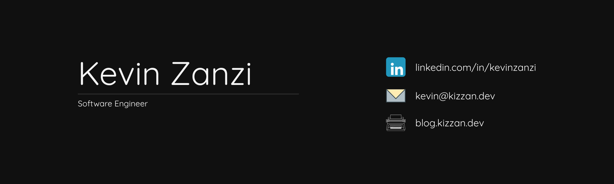

Hi, I'm Kevin 👋🏼! I am a Full Stack Software Engineer based in Buenos Aires, with a degree on Architectural Design. I enjoy the process of development and seeing those creations come to life.

<h2>Lets connect 🔌</h2>

<!--  -->

<!-- ORDER OF OPERATIONS
Programming Languages
Front End Development
Back End Development
Full Stack Development
Tools
Operating Systems
DevOps
Cloud
-->

<!-- 

  
<h2>Skills 💻</h2>
 -->

<h2 id="skills">Skills 💻</h2>

<!-- ### Programming Languages -->

<!--  -->
<!--  -->
<!--  -->
<!--  -->
<!--  -->

<!-- ### Front End Development -->

<!-- ### Back End Development -->

<!-- 
 -->

<!-- ### Full Stack Development -->

<!-- ### Tools -->

<!-- ### Operating Systems -->

<!--  -->

<!-- ### Languages -->

<!-- 
 -->

<!--  -->

<!-- 
 -->

<!--  -->

## Latest Articles at my Blog 📝

- [How to find your strengths](https://blog.kizzan.dev/en/article/how-to-find-your-strengths/) <time style="font-size: 0.8rem;color: #888">• 2025-07-23</time>
  - Strengths are where we naturally excel. It's important to know them to use them effectively, and if we don't find a place to apply them, we can look for or create opportunities that leverage them.

<!-- ## Últimos Artículos en mi Blog 📝

%{{ultimos_articulos}}% -->

<!-- ## Latest Videos 📺

%{{latests_youtube}}% -->

#

<!--  -->

